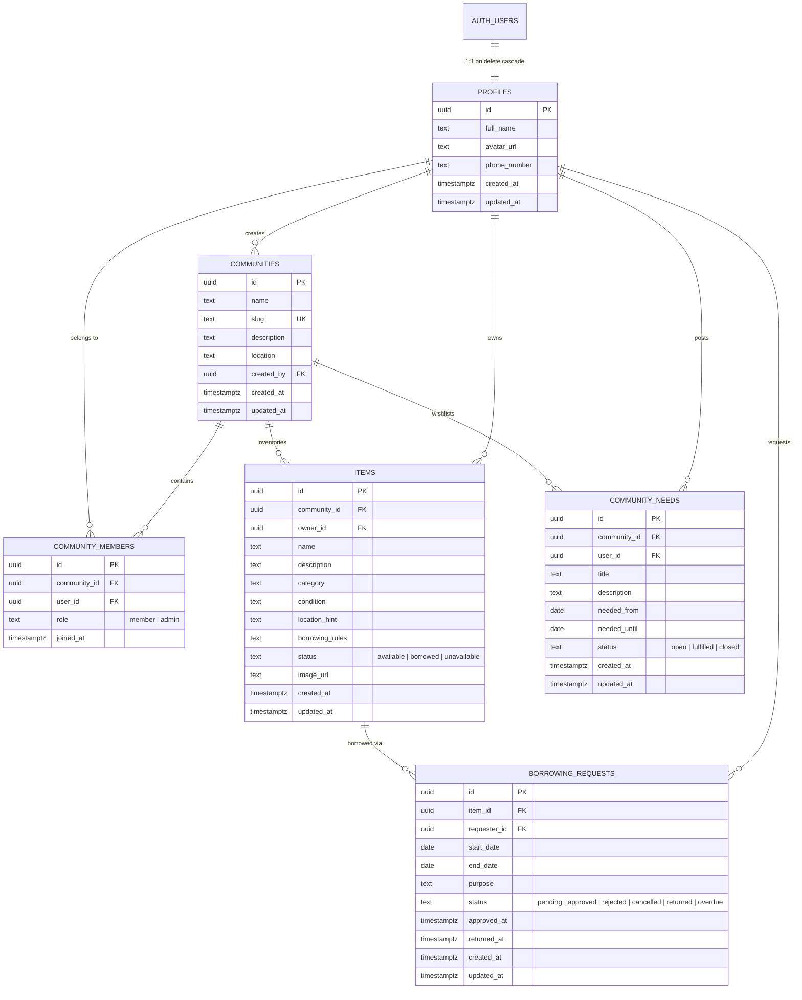
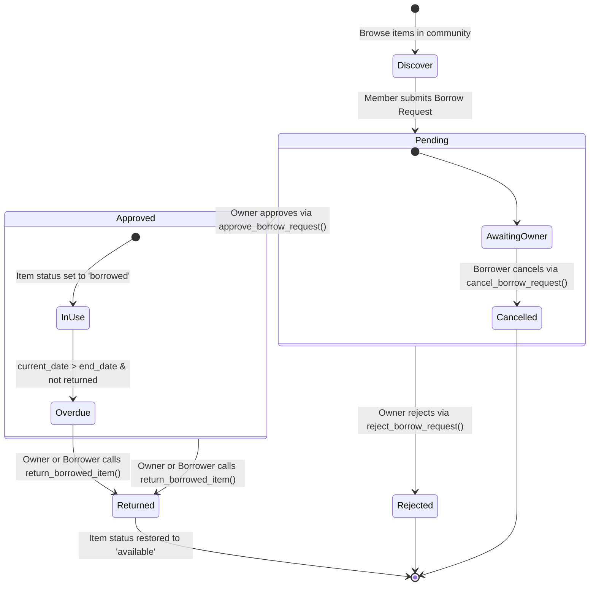

# COMMON — Backend Foundation

> **Share more. Own less. Access together.**

COMMON is a community shared-inventory platform where people in a neighborhood discover, access, and share useful physical resources (tools, ladders, projectors, camping gear, event equipment) that already exist in their community.

This repository contains the complete production-grade backend architecture built for **Supabase (PostgreSQL, Supabase Auth, Row Level Security, Storage, and RPC functions)**.

---

## 📁 Repository Structure

```text
COMMON/
├── README.md                                 # Root documentation & architecture overview
├── backend/                                  # Complete Supabase backend infrastructure
│   ├── README.md                             # Backend architecture & developer guide
│   ├── types/
│   │   └── database.types.ts                 # Generated TypeScript types for Supabase
│   └── supabase/
│       ├── config.toml                       # Local Supabase CLI configuration
│       ├── combined_migration.sql            # 1-Click execution script for Supabase SQL Editor
│       ├── seed.sql                          # Realistic seed data (RT 05 Commons demo)
│       └── migrations/
│           ├── 20260904000001_schema.sql     # Tables, constraints, and indexes
│           ├── 20260904000002_triggers.sql   # Database triggers (auth, updated_at, admin)
│           ├── 20260904000003_rls.sql        # Row Level Security (RLS) policies & helpers
│           ├── 20260904000004_rpc_functions.sql # Atomic lifecycle RPC functions
│           └── 20260904000005_storage.sql    # Storage bucket & access policies
└── frontend/                                 # Frontend application folder (SvelteKit + Tailwind + shadcn-svelte)
    ├── .env.example                          # Supabase environment variables template
    └── README.md                             # Frontend documentation & tech stack
```

---

## 1. Database Architecture

### Entity Relationship Diagram (ERD)



### Key Schema Design Decisions

1. **Decoupled User-to-Community Relationship (`community_members`)**:
   Instead of a hardcoded `community_id` column on the `profiles` table, a many-to-many junction table allows residents to belong to multiple neighborhoods (e.g., home RT, workplace community, makerspace) with specific roles (`member`, `admin`).
2. **Strict Availability Status (`items.status`)**:
   Status is strictly `available`, `borrowed`, or `unavailable`. It **never** uses `requested` because multiple members can submit pending requests simultaneously without altering item availability until the owner explicitly approves.
3. **Database-Level Anti-Overlap Constraint**:
   We utilize PostgreSQL's `btree_gist` extension to enforce an `EXCLUDE` constraint on `borrowing_requests`:
   ```sql
   CONSTRAINT uq_no_overlapping_approved_bookings
       EXCLUDE USING gist (
           item_id WITH =,
           daterange(start_date, end_date, '[]') WITH &&
       ) WHERE (status = 'approved');
   ```
   This guarantees that overlapping approved bookings are mathematically impossible at the storage engine level.
4. **Validation Triggers**:
   A `BEFORE INSERT` trigger on `borrowing_requests` prevents owners from borrowing their own items, verifies active membership in the item's community, and rejects requests for unavailable items.

---

## 2. Authorization & Row Level Security (RLS)

All application tables have Row Level Security enabled. Security policies are grounded in community membership and ownership.

### High-Performance Helper Functions
To avoid PostgreSQL infinite policy recursion when querying `community_members`, all policies use `SECURITY DEFINER` and `STABLE` helper functions:
* `is_community_member(community_id, user_id)`: Checks if a user belongs to a community.
* `is_community_admin(community_id, user_id)`: Checks if a user has the admin role.
* `shares_community_with(target_user_id, user_id)`: Checks if two users share at least one community.

### Access Control Matrix

| Table | Operation | Permission Rule |
| :--- | :--- | :--- |
| **`profiles`** | `SELECT` | Profile owner OR anyone sharing a community with the user |
| | `UPDATE` | Only the profile owner (`auth.uid() = id`) |
| **`communities`** | `SELECT` | Active members of that community (`is_community_member`) |
| | `INSERT` | Any authenticated user |
| | `UPDATE` | Community admins (`is_community_admin`) |
| **`community_members`**| `SELECT` | Members of the same community |
| | `INSERT/UPDATE`| Community admins |
| | `DELETE` | Community admins OR user self-leaving |
| **`items`** | `SELECT` | Community members only |
| | `INSERT` | Community members adding their own items (`owner_id = auth.uid()`) |
| | `UPDATE/DELETE`| Only the item owner |
| **`borrowing_requests`**| `SELECT` | The requester OR the item owner |
| | `INSERT` | Community members (excluding the item owner) |
| | `UPDATE` | Requester can cancel pending requests; all status transitions use RPC |
| **`community_needs`** | `SELECT` | Community members only |
| | `INSERT` | Community members |
| | `UPDATE/DELETE`| Creator of the need |
| **`storage.objects`** | `SELECT` | Community members sharing a community with the uploader |
| | `INSERT/UPDATE/DELETE` | Uploader only into `{user_id}/{filename}` |

---

## 3. The Borrowing Lifecycle

The core loop of COMMON follows five stages:



### Atomic RPC Functions

All sensitive state transitions are executed via PostgreSQL RPC functions with `SECURITY DEFINER` and transactional row-level locks (`FOR UPDATE`):

#### 1. `approve_borrow_request(p_request_id uuid)`
* **Caller**: Must be the item owner (`items.owner_id = auth.uid()`).
* **Validation**: Request must be `pending`. Checks for overlapping approved requests across the date range.
* **Effect**:
  * Request `status` -> `approved`
  * `approved_at` -> `now()`
  * Item `status` -> `borrowed`
* **Response**:
  ```json
  {
    "success": true,
    "message": "Borrowing request approved successfully.",
    "request_id": "...",
    "item_id": "...",
    "status": "approved",
    "item_status": "borrowed",
    "approved_at": "2026-09-04T08:18:00Z"
  }
  ```

#### 2. `reject_borrow_request(p_request_id uuid, p_reason text)`
* **Caller**: Must be the item owner.
* **Effect**: Request `status` -> `rejected`. Item status remains unchanged.

#### 3. `return_borrowed_item(p_request_id uuid)`
* **Caller**: Either the item owner OR the requester.
* **Validation**: Request must be `approved` or `overdue`.
* **Effect**:
  * Request `status` -> `returned`
  * `returned_at` -> `now()`
  * Item `status` -> `available` (if no other active concurrent borrowings exist)

#### 4. `cancel_borrow_request(p_request_id uuid)`
* **Caller**: The requester.
* **Validation**: Request must be `pending`.
* **Effect**: Request `status` -> `cancelled`.

#### 5. `sync_overdue_borrowing_requests()`
* **Execution**: Scheduled maintenance / cron or client trigger.
* **Effect**: Transitions all `approved` requests where `CURRENT_DATE > end_date` and `returned_at IS NULL` to `overdue`.

---

## 4. How to Deploy / Run in Supabase

### Option A: Supabase Web Dashboard (Fastest / 1-Click)

1. Log in to your [Supabase Dashboard](https://supabase.com/dashboard) and select your project.
2. Open the **SQL Editor** tab from the left sidebar.
3. Click **New query**.
4. Open [supabase/combined_migration.sql](file:///c:/projek/COMMON/supabase/combined_migration.sql), copy its entire content, paste it into the editor, and click **Run**.
5. *(Optional Demo Data)*: Create another query, paste [supabase/seed.sql](file:///c:/projek/COMMON/supabase/seed.sql), and click **Run**.
6. Navigate to **Table Editor** to inspect the tables and **Storage** to confirm the `item-images` bucket.

### Option B: Supabase CLI (Local Development or CI/CD)

1. Make sure Docker is running and initialize the local instance:
   ```bash
   npx supabase start
   ```
2. Apply the migrations in sequence:
   ```bash
   npx supabase db reset
   ```
   *(This automatically applies `supabase/migrations/` and `supabase/seed.sql`)*.
3. To link and push to your remote project:
   ```bash
   npx supabase login
   npx supabase link --project-ref your-project-ref
   npx supabase db push
   ```

---

## 5. Demo Seed Data (`RT 05 Commons`)

The seed data provides an authentic neighborhood cluster:
* **Community**: `RT 05 Commons` (`rt-05-commons`) in Jakarta Selatan.
* **8 Residents**:
  1. `budi@rt05.commons.id` — Pak Budi Santoso (RT Head / Admin)
  2. `siti@rt05.commons.id` — Ibu Siti Rahma (Gardener & Baker)
  3. `arif@rt05.commons.id` — Arif Hidayat (DIY woodworker)
  4. `dian@rt05.commons.id` — Dian Prasetyo (Electronics hobbyist)
  5. `hendra@rt05.commons.id` — Hendra Wijaya (Outdoor & camping enthusiast)
  6. `maya@rt05.commons.id` — Maya Indah (Event organizer)
  7. `rizky@rt05.commons.id` — Rizky Pratama (Car & home maintenance)
  8. `dewi@rt05.commons.id` — Dewi Lestari (Photographer & AV creator)
  *(Default password for all seed accounts: `Password123!`)*
* **18 Shared Items**: Power drill, telescopic ladder, 120-pc toolbox, pressure washer, cordless jigsaw, wet/dry vacuum, garment steamer, electric lawn mower, hand truck dolly, spot cleaner, full HD cinema projector, JBL PartyBox speaker, event tables, wireless mics, 4-person tent, 50L rolling cooler, portable gas stove, and 600W power station.
* **Live Borrowing States**:
  * Active approved borrowings (`borrowed` status)
  * Pending requests awaiting owner review
  * Returned past requests (`available` status restored)
  * Overdue request (`overdue` status)
  * Rejected request with reason
* **Community Needs Wishlist**: Leaf blower for community garden, 84-inch projector screen, rotary hammer drill.

---

## 6. SvelteKit Frontend Integration

When building the SvelteKit frontend, configure the following environment variables:

### `.env`
```env
PUBLIC_SUPABASE_URL=https://your-project-id.supabase.co
PUBLIC_SUPABASE_ANON_KEY=eyJhbGciOiJIUzI1NiIsInR5cCI6IkpXVCJ9...
```

### Client Setup Example (`src/lib/supabaseClient.ts`)

```typescript
import { createClient } from '@supabase/supabase-js';
import type { Database } from '../../types/database.types';
import { PUBLIC_SUPABASE_URL, PUBLIC_SUPABASE_ANON_KEY } from '$env/static/public';

export const supabase = createClient<Database>(
  PUBLIC_SUPABASE_URL,
  PUBLIC_SUPABASE_ANON_KEY
);
```

### Invoking RPC Functions in SvelteKit

```typescript
// Approving a request (only owner)
const { data, error } = await supabase.rpc('approve_borrow_request', {
  p_request_id: requestId
});

// Returning an item (owner or borrower)
const { data, error } = await supabase.rpc('return_borrowed_item', {
  p_request_id: requestId
});

// Rejecting a request
const { data, error } = await supabase.rpc('reject_borrow_request', {
  p_request_id: requestId,
  p_reason: 'Item is being serviced this weekend'
});
```
